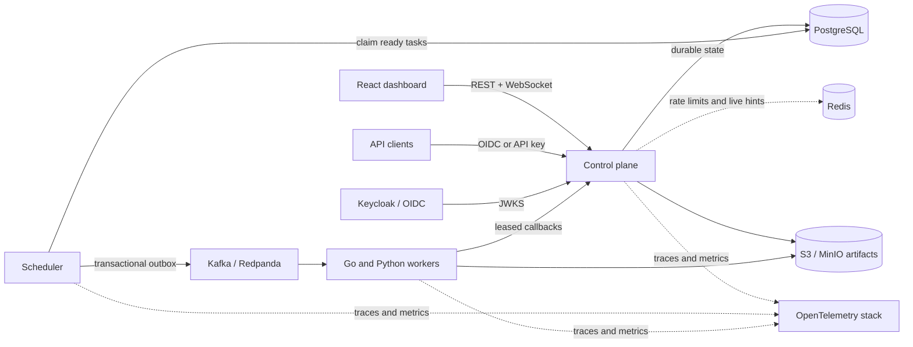
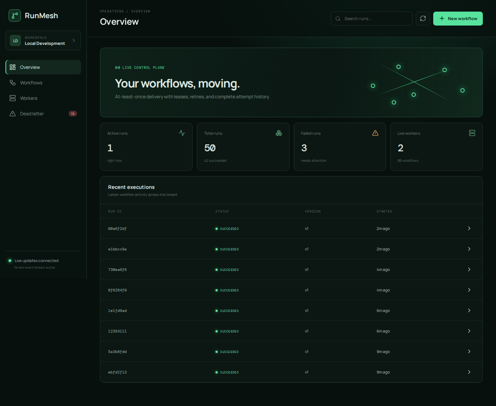
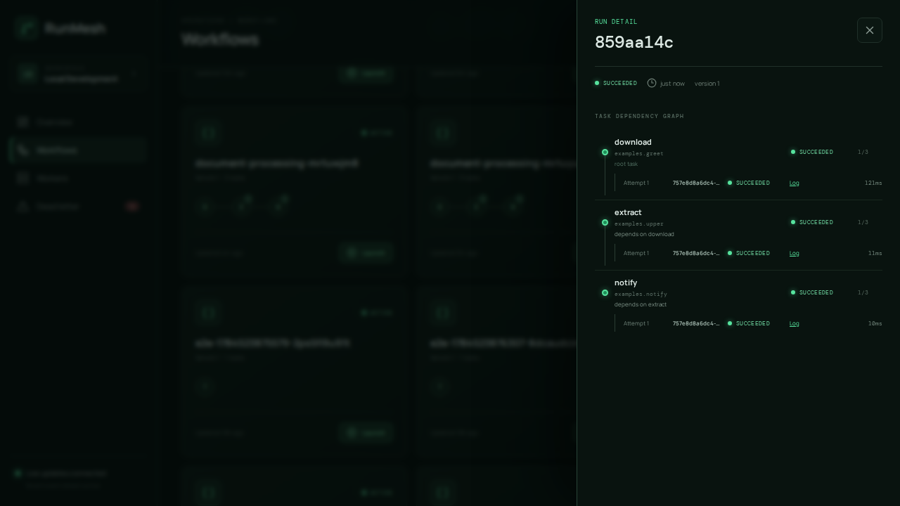
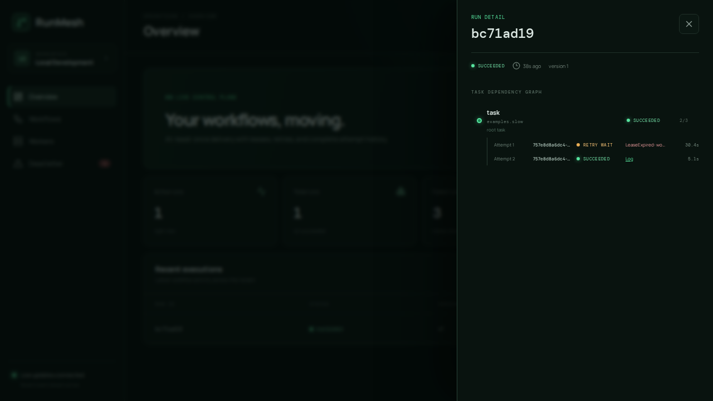

# RunMesh

[](https://github.com/samarth1412/RunMesh/actions/workflows/ci.yml)
[](https://github.com/samarth1412/RunMesh/actions/workflows/codeql.yml)
[](go.mod)
[](sdk/python/pyproject.toml)
[](compose.yaml)

**A multi-tenant, failure-tolerant workflow orchestrator built for durable execution.**

RunMesh stores versioned DAGs, schedules dependency-aware tasks, and delivers work with at-least-once semantics. PostgreSQL is the source of truth, a transactional outbox bridges state to Kafka/Redpanda, and expiring leases let work recover safely after worker or infrastructure failures.

| See it | Run it | Verify it |
| --- | --- | --- |
| [Dashboard demo](#demo) | `docker compose up --build -d` | [Raw benchmark evidence](tests/benchmarks/results/) |

It ships as a complete local platform: Go control plane and scheduler, Go and Python workers, a React operations dashboard, OIDC authentication, tenant-scoped API keys, S3-compatible artifacts, live updates, metrics, logs, traces, Helm charts, and validated AWS Terraform.

Latest local evidence on an Apple M4 / 16 GiB machine: **407.403 scheduler
dispatches/second across 10,000 tasks**, **100.0 authenticated reads/second
at 3.307 ms p95**, and **10,000/10,000 tasks completed with zero permanent
loss after all 20 workers were terminated**. These are reproducible local
Docker results, not production-capacity claims.

## Highlights

- **Durable execution** — transactional run creation, dependency-aware scheduling, fenced state transitions, retries, cancellation, and dead-letter replay.
- **Failure tolerance** — expiring worker leases, worker-crash recovery, duplicate-delivery safety, and an outbox that survives broker outages.
- **Tenant isolation** — every resource query and worker operation is tenant-scoped; production identity uses verified OIDC JWTs or scoped API keys.
- **Artifact pipeline** — presigned S3/MinIO transfers for inputs, outputs, and structured logs, with automatic offload for results larger than 256 KiB.
- **Production controls** — atomic per-tenant Redis rate limiting, audit records, request limits, restricted containers, NetworkPolicies, HPAs, and disruption budgets.
- **Operations built in** — a live WebSocket dashboard plus Prometheus, Grafana, Loki, Tempo, OpenTelemetry, and structured JSON logs.
- **Tested failure modes** — coverage for duplicate delivery, Redis/MinIO/PostgreSQL/Kafka disruption, worker termination, lease recovery, and cross-tenant access.

## Architecture



PostgreSQL remains authoritative throughout the lifecycle. Kafka delivery can be duplicated, Redis live notifications can be dropped, and workers can disappear; task IDs, conditional updates, leases, and durable API reads keep execution correct.

Read the deeper [architecture](docs/architecture.md), [delivery semantics](docs/delivery-semantics.md), and [failure-mode analysis](docs/failure-modes.md).

## Demo

The dashboard is exercised against the real Compose stack in Playwright; it does not use a mock API. The [one-minute recovery video](docs/demo/runmesh-recovery.webm) creates and runs a DAG, terminates both bundled workers during an active lease, and shows the successful recovered attempt.

| Operations overview | Completed dependency graph |
| --- | --- |
|  |  |



The exact capture procedure is documented with the media in [`docs/demo`](docs/demo/README.md); no mock API or generated screenshot is used.

## Quick start

You need Docker Engine/Desktop with Docker Compose v2, `curl`, and Python 3.

```bash
git clone https://github.com/samarth1412/RunMesh.git
cd RunMesh
docker compose up --build -d
docker compose ps
```

Once the stack is ready, open the dashboard at [localhost:3000](http://localhost:3000) and sign in with the local development account:

```text
username: admin
password: runmesh
```

The credentials and exposed ports are for local development only.

| Service | URL | Notes |
| --- | --- | --- |
| Operations dashboard | [localhost:3000](http://localhost:3000) | Keycloak login and live run updates |
| REST API / OpenAPI | [localhost:8080/docs](http://localhost:8080/docs) | Public API and interactive specification |
| Grafana | [localhost:3001](http://localhost:3001) | `admin` / `runmesh` |
| Redpanda Console | [localhost:8081](http://localhost:8081) | Topics, messages, and consumer groups |
| MinIO Console | [localhost:9001](http://localhost:9001) | `runmesh` / `runmesh-development` |
| Prometheus | [localhost:9090](http://localhost:9090) | Metrics and alert rules |
| Worker gRPC API | `localhost:7001` | Lease and task lifecycle RPCs |

Stop the stack without deleting its volumes:

```bash
docker compose down
```

## Run a workflow from the API

Obtain a local OIDC access token, create a workflow, and start a run:

```bash
TOKEN="$(curl -fsS http://localhost:8180/realms/runmesh/protocol/openid-connect/token \
  -d grant_type=password \
  -d client_id=runmesh-web \
  -d username=admin \
  -d password=runmesh \
  | python3 -c 'import json,sys; print(json.load(sys.stdin)["access_token"])')"

WORKFLOW_ID="$(curl -fsS http://localhost:8080/v1/workflows \
  -H "Authorization: Bearer $TOKEN" \
  -H 'Content-Type: application/json' \
  -d '{"name":"hello","tasks":{"greet":{"handler":"examples.greet"}}}' \
  | python3 -c 'import json,sys; print(json.load(sys.stdin)["id"])')"

RUN_ID="$(curl -fsS "http://localhost:8080/v1/workflows/$WORKFLOW_ID/runs" \
  -H "Authorization: Bearer $TOKEN" \
  -H 'Content-Type: application/json' \
  -H 'Idempotency-Key: hello-first-run' \
  -d '{"input":{"name":"Ada"}}' \
  | python3 -c 'import json,sys; print(json.load(sys.stdin)["id"])')"

curl -fsS "http://localhost:8080/v1/runs/$RUN_ID" \
  -H "Authorization: Bearer $TOKEN" \
  | python3 -m json.tool
```

The bundled workers handle `examples.greet`, `examples.upper`, `examples.notify`, and other test handlers. A real Python worker uses the same model:

```python
from runmesh import TaskContext, Worker

worker = Worker(
    endpoint="localhost:7001",
    http_endpoint="localhost:8080",
    api_key="rm_<id>_<secret>",
    brokers="localhost:19092",
)

@worker.task("documents.extract")
async def extract(payload: dict, context: TaskContext) -> dict:
    context.raise_if_cancelled()
    return {"text": "processed", "source": payload["document_id"]}

worker.run()
```

See the complete [Python worker example](examples/python_worker.py) and the [artifact guide](docs/artifacts.md).

The canonical Go SDK import is:

```go
import runmesh "github.com/samarth1412/RunMesh/sdk/go"

client := runmesh.NewClient("localhost:7001", "rm_<id>_<secret>", "worker-1")
defer client.Close()
```

## Reliability model

RunMesh deliberately promises **at-least-once**, not exactly-once, execution. Task handlers that perform side effects should deduplicate using the stable `context.idempotency_key`.

- Workflow submission is idempotent within a tenant when the same `Idempotency-Key` is reused.
- Scheduler replicas claim separate work with `FOR UPDATE SKIP LOCKED`.
- Worker mutations include the task, expected state, worker identity, and valid lease.
- Timed-out leases return work to the scheduler without discarding attempt history.
- Per-run Kafka partition keys retain event ordering.
- Redis is outside the durable execution path; a Redis outage does not stop scheduling or workers.
- Production public requests fail closed when Redis cannot enforce tenant rate limits.

## Security model

Production mode validates OIDC signature, issuer, audience, expiry, and a signed tenant claim. The subject must match a pre-provisioned PostgreSQL user, and roles come from the database rather than token claims.

Automation and workers use tenant-scoped credentials in the form `rm_<id>_<secret>`. Only a SHA-256 hash bound to an application pepper is stored. Keys support scopes, expiry, rotation, revocation, and audit history; plaintext is returned only at creation or rotation.

The shared development identity is accepted only when development authentication is explicitly enabled. See the complete [security model](docs/security.md).

## Observability

The local stack includes six provisioned Grafana dashboards covering platform health, scheduling, workers, Kafka lag, workflow failures, and tenant usage. Metrics include scheduling and execution latency, workflow duration, worker heartbeat age, artifact latency, Redis failures, and tenant activity.

Trace context flows through HTTP requests, PostgreSQL/outbox records, Kafka messages, workers, and artifact operations. JSON logs include service, tenant, workflow, task, trace, and span identifiers whenever available.

## Validation evidence

The repository includes unit, race, integration, browser, security, chaos, deployment, and rolling-upgrade checks. The dated local benchmark run on an Apple M4 MacBook Air with 16 GiB RAM recorded:

| Scenario | Recorded result |
| --- | ---: |
| Authenticated API reads | 100.0 req/s; 1.701/3.307/4.657 ms p50/p95/p99; 0 failures |
| Workflow submissions | 50.028 req/s; 1.587/7.012/220.024 ms p50/p95/p99; 0 failures |
| Simultaneously active workflows | 1,000 created; 0 failures; 57.608 tasks/s drain |
| Scheduler dispatch | 407.403 tasks/s across 10,000 tasks |
| Worker termination and recovery | 20 workers terminated; 10,000/10,000 succeeded; 7 recovered attempts; 0 lost |
| Duplicate submission and delivery | Passed |

These numbers are transparent local evidence, not a universal capacity claim. Hardware details, commands, image digests, source SHA, and raw machine-readable output are committed in the [2026-07-21T003600Z benchmark results](tests/benchmarks/results/2026-07-21T003600Z/README.md), the canonical run against the current `HEAD`. The complete [local validation ledger](docs/validation.md) separates executed checks from remote or cloud work that remains unverified.

## Development

For local development outside Compose, install Go 1.25, Python 3.11+, and Node.js 22, then install SDK and dashboard dependencies:

```bash
python3 -m pip install -e 'sdk/python[dev]'
npm --prefix web ci
```

Run the core test suites:

```bash
go test -race ./cmd/... ./internal/... ./sdk/go/...
(cd sdk/python && pytest)
npm --prefix web test -- --run
```

Useful commands:

```bash
make compose-up       # build and run the local platform
make integration      # Docker-backed integration and failure tests
make test             # Go, Python, and web unit suites
make lint             # format/check Go, Python, and TypeScript
```

CI also validates protobuf compatibility, container vulnerability scans, Terraform, Helm, rendered Kubernetes manifests, Playwright flows, and a live kind rolling upgrade.

Coverage gates intentionally target risk rather than 100%: the workflow state machine, authentication, live event broker, Python worker, and dashboard each have documented minimums in CI. Docker-backed integration tests cover PostgreSQL scheduler and storage behavior.

## Limitations and future work

- Published performance evidence is from one local Docker Desktop machine, not a production capacity guarantee.
- The AWS Terraform is formatted, validated, and tested with mock providers; it has not been applied and no AWS deployment is claimed.
- Useful worker parallelism is bounded by Kafka partition count, and a single workflow run remains intentionally confined to one partition.
- Workers in the same Kafka consumer group must expose the same handler set; heterogeneous capability pools require separate group IDs.
- The outbox removes broker I/O from database transactions, but PostgreSQL claim and acknowledgement writes still bound dispatch throughput.
- The recorded 10,000-task crash run recovered all interrupted leases, but the
  recovered-attempt delay was 132.797 seconds p50 under backlog; prioritizing
  expired leases is future work.
- At-least-once execution cannot make arbitrary handler side effects exactly-once. Handlers must use the stable task idempotency key.
- Redis Pub/Sub notifications are best-effort; the dashboard re-reads durable state and falls back to polling.
- The repository prepares `v0.1.0`, but no release or versioned image is published until a maintainer explicitly creates the tag.

## Deployment

The Helm chart deploys independently scalable control-plane, scheduler, dashboard, and worker pools with probes, resource limits, autoscaling, disruption budgets, restricted security contexts, and default-deny NetworkPolicies.

The AWS Terraform covers EKS integrations, IAM/IRSA artifact access, load-balancer controller support, optional Route 53/ACM configuration, CloudWatch, ECR lifecycle policies, and security groups. Kafka is intentionally supplied as an external endpoint. Infrastructure is validated in CI but is never applied automatically.

Pushing a `v*` tag builds five multi-architecture GHCR images with semantic-version and SHA tags, SBOMs, provenance attestations, and Trivy scanning. Follow the [deployment and release guide](docs/deployment.md) before using production credentials or applying infrastructure.

## Repository guide

| Path | Purpose |
| --- | --- |
| [`cmd/control-plane`](cmd/control-plane) | REST API, WebSocket stream, and worker callbacks |
| [`cmd/scheduler`](cmd/scheduler) | Ready-task claims, lease recovery, and outbox publishing |
| [`cmd/worker-go`](cmd/worker-go) | Go worker implementation and interoperability example |
| [`internal`](internal) | Domain logic, storage, scheduling, auth, messaging, and telemetry |
| [`sdk/python`](sdk/python) | Python worker SDK |
| [`proto`](proto) | Backward-compatible worker protocol |
| [`web`](web) | React and TypeScript operations dashboard |
| [`deploy`](deploy) | Compose dependencies, observability config, and Helm chart |
| [`infra/terraform`](infra/terraform) | Validated AWS infrastructure modules |
| [`tests`](tests) | Integration, E2E, chaos, load, deployment, and benchmark suites |

## Documentation

- [Architecture](docs/architecture.md)
- [Delivery semantics](docs/delivery-semantics.md)
- [Failure modes](docs/failure-modes.md)
- [Security model](docs/security.md)
- [Artifact handling](docs/artifacts.md)
- [Benchmarks](docs/benchmarks.md)
- [Local validation report](docs/validation.md)
- [Deployment and releases](docs/deployment.md)
- [Architecture decisions](docs/adr/)
- [Draft v0.1.0 release notes](docs/release-v0.1.0.md)
